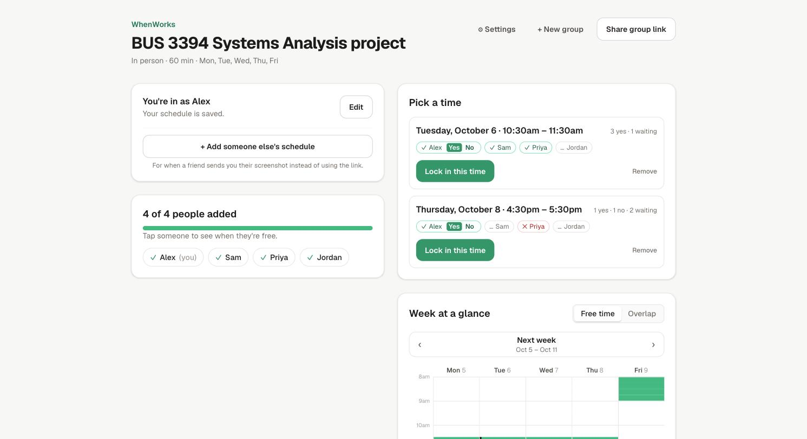
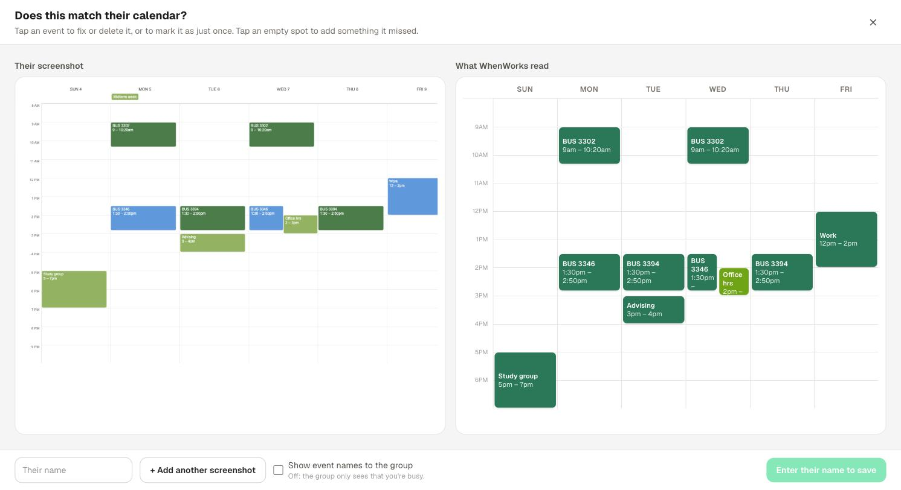
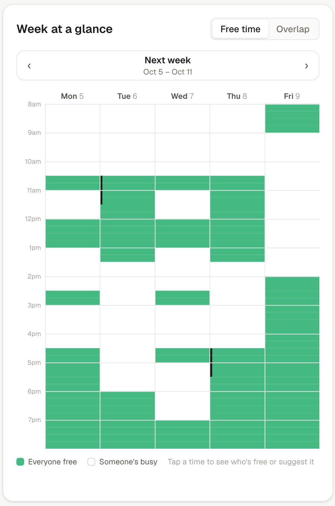
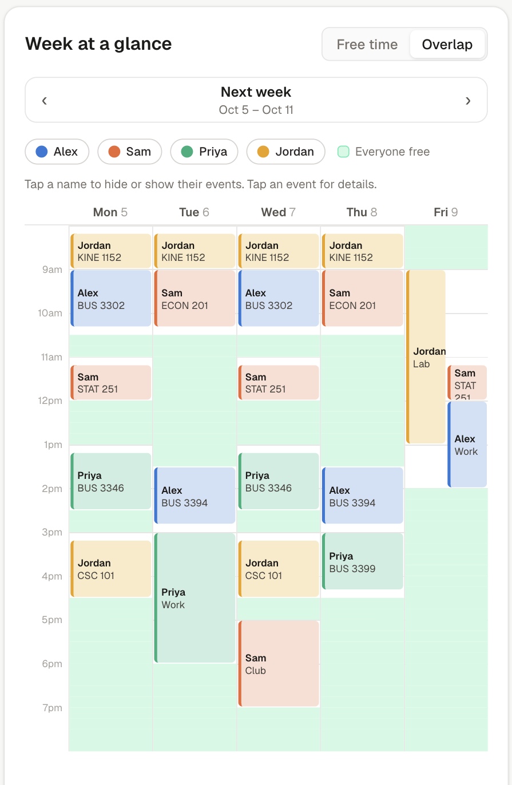
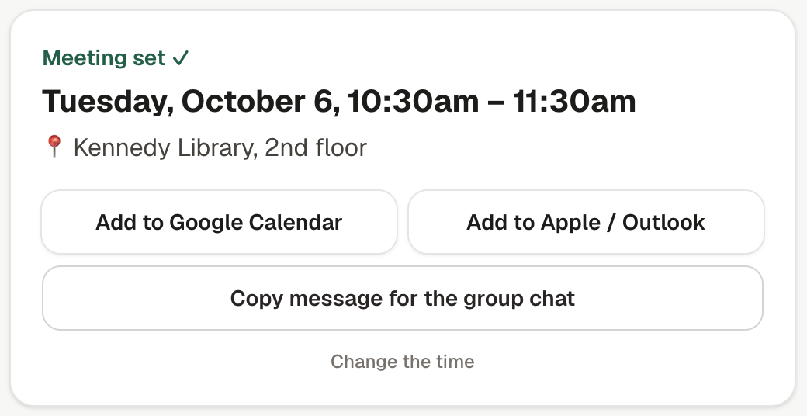

# WhenWorks

**Find a time when everyone in your group project is actually free.**

Group chats are a terrible place to schedule a meeting. WhenWorks replaces "when is everyone free?" with one link:
everyone uploads a screenshot of their schedule, the site reads it, and the times that work for the whole group
light up. Pick one, vote, and send everyone the calendar invite.

**Try it: [usewhenworks.vercel.app](https://usewhenworks.vercel.app)**



## How it works

1. **Make a group link** and paste it in the group chat. Choose in person or online, how long the meeting is, and
   which days and hours could work.
2. **Everyone uploads a screenshot** of their class schedule or calendar (Google Calendar, Apple Calendar, a school
   portal, anything with times and days). No accounts, and no painting a grid by hand.
3. **Check what it read.** WhenWorks draws a calendar of what it found right next to the screenshot. Tap any event to
   fix it, or tap an empty spot to add one it missed.
4. **See when everyone is free.** Green means everyone can make it.
5. **Suggest a time, vote, and lock it in.** Then add it to Google Calendar, Apple Calendar or Outlook in one tap,
   with a Google Meet link for online calls.

| Check the screenshot | Everyone's free time |
| --- | --- |
|  |  |

| Who's busy when | The meeting, ready to add |
| --- | --- |
|  |  |

## Features

- **Screenshot reading.** Google's Gemini AI turns a schedule screenshot into busy times. It handles layered
  calendars with events side by side, columns labeled only with dates ("SEP 28"), and two time zones on the axis.
  It also skips all-day events and asynchronous classes.
- **Weekly or one-time events.** Classes repeat every week; one-off things like an interview only block their own
  week. The AI suggests which is which and you can flip any event.
- **Free time and overlap views.** See green when everyone is free, or switch to Overlap to see everyone's events in
  their own color and who's in the way.
- **Suggest, vote, confirm.** Anyone can suggest a time; people vote yes or no; once everyone's in, lock it in.
- **Calendar invites.** Add to Google Calendar, an `.ics` file for Apple Calendar and Outlook, a Google Meet or free
  Jitsi link for online meetings, and a ready-to-paste message for the group chat.
- **Add a friend's schedule.** If someone just texts you their screenshot, upload it for them under their name.
- **Group progress.** "3 of 5 people added", with a reminder to copy into the chat.
- **Private by default.** The group only sees *when* you're busy, not what your events are, unless you choose to
  share event names.
- **Works on iPhone.** Pick screenshots straight from Photos, with step-by-step tips for taking one.

## Privacy

- Screenshots are sent to Gemini to be read and are never stored. Only the busy times are saved.
- Event names are hidden from the rest of the group unless you turn sharing on.
- There are no accounts. Each browser keeps a private key for the schedules it added, so only you can edit or remove
  yours, and only the group's creator can change its settings or delete it.
- Screenshot reading is limited to 10 per hour per person, so the free AI allowance stays available for everyone.

## Built with

- [Next.js](https://nextjs.org) (App Router, TypeScript) and [Tailwind CSS](https://tailwindcss.com)
- [Google Gemini](https://ai.google.dev) (free tier) for reading screenshots
- [Neon](https://neon.tech) Postgres for storing groups
- Hosted on [Vercel](https://vercel.com), redeployed on every push to `main`

## Run it locally

```bash
npm install
cp .env.example .env.local   # paste in a free Gemini key from https://aistudio.google.com/apikey
npm run dev                  # open http://localhost:3000
```

Without a `DATABASE_URL`, groups are saved to `data/groups.json` on your computer.

## Deploying

The Vercel project needs:

- a `GEMINI_API_KEY` environment variable
- a Neon Postgres database connected through the Vercel Marketplace (it adds `DATABASE_URL`). The tables are created
  automatically on first use.
